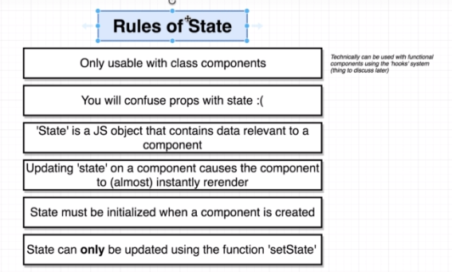

## Requirements
- Nodejs
- NPM  
- Install create-react-app
  
## steps
To install create-react-app 
```
npm install -g create-react-app
npm create-react-app <name of the project>
or 
npx create-react-app <name of project>
```
the command notations means :


## Why Create React App ?
 We use javascript for our app and only ES5 are supported in all softwares but as newer version are available for ease of coders we need to use those versions but browsers may or maynot support .. 
 #### babel (cmd line tool ) is used to solve the issue 
 it converts js files of other versions to ES5 JS and can work seemlessly on all browser 

and **babel** is included in every **REACT App** 

## files created in react app


## Start react app
```
npm start
```
our new app opens in our localhost:3000
few points to operate :
- ctrl + c  to stop the terminal running out app
- npm start to run , run cmd inside project directory

### Possible errors
- Port already in use 
  - it ask to run on another host 
  - u can turn off the running app and can use in 3000.

- localhost not working
  - find address of 'On your network' 
  - paste that instead of localhost then we can use
  
## index.js 
the file to start coding with contains stuffs such as : -
1. import th react and ReactDOM libraries
we import libraries like 
```
   import React from 'react';
   import ReactDOM from 'react-dom';
```
and the 'library name' at last which is taken from node modules 
 the terms actual meanings 

2. create a react component 
   
   helps us to create the displayable content on the webpage and also handle user inputs 
```
const App = function() {
    return <div> Hi there!</div>
}

```
3. Take the react component and display on screen
   render function from reactDOM package helps us here and we call the functions and the ids here only 
```
ReactDOM.render (
    <App/>,
    document.querySelector('#root')
);
```

# What is Jsx ?
his funny tag syntax is neither a string nor HTML.

It is called JSX, and it is a syntax extension to JavaScript. We recommend using it with React to describe what the UI should look like. JSX may remind you of a template language, but it comes with the full power of JavaScript.


tools like **babel**.

## Why Jsx ?
React embraces the fact that rendering logic is inherently coupled with other UI logic: how events are handled, how the state changes over time, and how the data is prepared for display.

React doesn’t require using JSX, but most people find it helpful as a visual aid when working with UI inside the JavaScript code. It also allows React to show more useful error and warning messages.


## JSX VS HTML


1. the inline styling is like 
   - **remember**  double braces {{}} and element rather say other than jsx element we wrap it in string as '**property**'
   - so for just convention we use jsx properties we use "" and for non jsx ''(single quotes).
   

2. we use diff class notation for div in jsx just to distinguish it from class we use in javascript and the styling or notation class
   ```
    <label className="label" htmlFor="name">Enter name :</label>
    ```
    like className and htmlFor here

3. variable referencing or function referencing 
 
just declare a variable or constant or function and we can call it using { } where we want. 

**Note** 
```
const buttonText = { text : 'Click me' }; 
```
doesnot work when called using **{buttonText}**. beacuse  javascript object cannot be a react child so 
**fix** is **{buttonText.text}** instead of that this will call or read the 'click me'. from js object.

```
Semantic UI CDN Link

<link rel="stylesheet" href="https://cdnjs.cloudflare.com/ajax/libs/semantic-ui/2.4.1/semantic.min.css"/>
```

 ## 3 Tents of Components

 -  ### Component

 

 

normal process of creating 
```
return (
      <div className="ui container comments">
        <div className="comment">
          <a href="/" className="avatar">
            
          </a>
          <div className="content">
            <a href="/" className="author">
              Sam
            </a>
            <div className="metadata">
              <span className="date">Today at 6:00PM</span>
            </div>
            <div className="text">Nice blog post!</div>
          </div>
        </div>
      </div>
    );
```

Faker .JS  for  fake names and all
```
npm install --save faker

and add this on the file
import faker from 'faker';
```


component nesting

Component helps u to create reusable code and the above code for blog becomes a function named **CommentDetail**
like
```
import faker from 'faker';

const CommentDetail = () =>{
  return (
    <div className="comment">
          <a href="/" className="avatar">
            
          </a>
          <div className="content">
            <a href="/" className="author">
              {faker.name.findName()}
            </a>
            <div className="metadata">
              <span className="date">Today at 6:00PM</span>
            </div>
            <div className="text">{faker.lorem.sentence()}</div>
    </div>
</div>

  );
}

export default CommentDetail; (add this at last so that we can use it as component in our main js file and import it)

and add import line on the main file 
import CommentDetail from './CommentDetail';
```
now we can use the function as a tag to write or create the multiple blogs
with just 
```
<CommentDetail/>
```

## REACT PROPS SYSTEM
 for different entry
 so new parameters gets passed and no **limitations** on the no. of parameters

#### Syntax of a Prop


and for props to be effective we need to add them in the function argument that we are using 
```
const CommentDetail = props =>{
  {props.author} ---> instead of the name 
}
```

- ### REUSE 

This feature we use to inherit same classes to make similiar items such as buttons or cards or some divs with class inorder to make things look simpler and it creates tags with names for the further reusabilty of it.


The highlighted one is the tag we created called **Segment** which contains the box css properties and being used by 2 sections or divisions .

## CLASS BASED *COMPONENTS*


Lets discuss the class components

compenents of the class 


we have the objects of class available with a . (dot) and it tkes less time to reload and fetch us data faster and 
we can also apply the **inheritence** 

so some basic rules of creating a class component are!

[](2021-05-28-14-17-06.png)

Syntax of a class component :-
```
class App extends React.Component {
    render() {
        window.navigator.geolocation.getCurrentPosition(
          position => console.log(position),
          err => console.log(err)
        );
    return (

        );
    }
}
```

## State system in react 

and its rules and restrictions.

#### Important ! State can **only** be updated using the function '***setState***'.

use of setstate and state function to fetch latitude from the api and use constructor to initiate the state.
<details><summary>Code with constructor / state / setstate /api fetch </summary>


<details>
class App extends React.Component {
    constructor(props){
        super(props);
        this.state = {lat : null};
        window.navigator.geolocation.getCurrentPosition(
            position => {
                this.setState({lat : position.coords.latitude});
                //dont do ever never ever 
                //this.state.lat = position.coords.latitude
            },
            err => console.log(err)
          );
    }
    render() {
    return <div>Latitude : {this.state.lat} </div>;
    }
}
</details>

How this thing works :
- First we make class that extends its function from react components
- Constructor called to initialize the props or state 
- render function renders the output of the code 
- Api gets us the values from the user pc 
- using *setstate* the value is being updated to the state value in the constructor
- the api call is moved to the constructor so render is called less during execution 
- and finally we use the state variables in render to display the data 
- if else statement for conditionality.


</details>

### Conditional Rendering
```
render() {
        if(this.state.errM && !this.state.lat)
            return <div> Error : {this.state.errM} </div>

        if(!this.state.errM && this.state.lat)
            return <div> Latitude : {this.state.lat} </div>
    
        else
            return <div>Loading! </div>
    }
```

## Component Life cycle methods
```
componentDidMount(){
        console.log("didmount");
    }

componentDidUpdate(){
        console.log("didupdate");
    }
```
the component functions helps us to do the pre calculations or pre fetching that needs to be done before calling render --- just like api call so we can place the api call inside the life cycle methods 

### state , babel and constructor theory 
As the js file in react passes through babel so it converts the code into all the javascript readable file and 
writing state call with constructor can be written as simple 
```
state = { lat : null}

------------------which babel converts to -------------

constructor(props){
        super(props);

        this.state = {lat : null , errM : ""};
    }
```
so writing constructor is not required mandatory !!!!!!!! 


