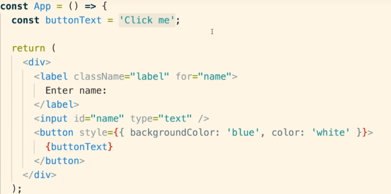

## Requirements
- Nodejs
- NPM  
- Install create-react-app
  
## steps
To install create-react-app 
```
npm install -g create-react-app
npm create-react-app <name of the project>
or 
npx create-react-app <name of project>
```
the command notations means :


## Why Create React App ?
 We use javascript for our app and only ES5 are supported in all softwares but as newer version are available for ease of coders we need to use those versions but browsers may or maynot support .. 
 #### babel (cmd line tool ) is used to solve the issue 
 it converts js files of other versions to ES5 JS and can work seemlessly on all browser 

and **babel** is included in every **REACT App** 

## files created in react app


## Start react app
```
npm start
```
our new app opens in our localhost:3000
few points to operate :
- ctrl + c  to stop the terminal running out app
- npm start to run , run cmd inside project directory

### Possible errors
- Port already in use 
  - it ask to run on another host 
  - u can turn off the running app and can use in 3000.

- localhost not working
  - find address of 'On your network' 
  - paste that instead of localhost then we can use
  
## index.js 
the file to start coding with contains stuffs such as : -
1. import th react and ReactDOM libraries
we import libraries like 
```
   import React from 'react';
   import ReactDOM from 'react-dom';
```
and the 'library name' at last which is taken from node modules 
 the terms actual meanings 

2. create a react component 
   
   helps us to create the displayable content on the webpage and also handle user inputs 
```
const App = function() {
    return <div> Hi there!</div>
}

```
3. Take the react component and display on screen
   render function from reactDOM package helps us here and we call the functions and the ids here only 
```
ReactDOM.render (
    <App/>,
    document.querySelector('#root')
);
```

# What is Jsx ?
his funny tag syntax is neither a string nor HTML.

It is called JSX, and it is a syntax extension to JavaScript. We recommend using it with React to describe what the UI should look like. JSX may remind you of a template language, but it comes with the full power of JavaScript.


tools like **babel**.

## Why Jsx ?
React embraces the fact that rendering logic is inherently coupled with other UI logic: how events are handled, how the state changes over time, and how the data is prepared for display.

React doesn’t require using JSX, but most people find it helpful as a visual aid when working with UI inside the JavaScript code. It also allows React to show more useful error and warning messages.


## JSX VS HTML


1. the inline styling is like 
   - **remember**  double braces {{}} and element rather say other than jsx element we wrap it in string as '**property**'
   - so for just convention we use jsx properties we use "" and for non jsx ''(single quotes).
   

2. we use diff class notation for div in jsx just to distinguish it from class we use in javascript and the styling or notation class
   ```
    <label className="label" htmlFor="name">Enter name :</label>
    ```
    like className and htmlFor here

3. variable referencing or function referencing 
 
just declare a variable or constant or function and we can call it using { } where we want. 

**Note** 
```
const buttonText = { text : 'Click me' }; 
```
doesnot work when called using **{buttonText}**. beacuse  javascript object cannot be a react child so 
**fix** is **{buttonText.text}** instead of that this will call or read the 'click me'. from js object.


 ## 3 Tents of Components
 

 